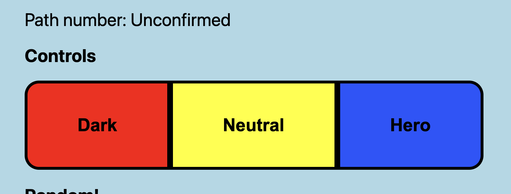

# Shadow The Hedgehog Tracker

This is a simple tool for tracking endings in the [Shadow the Hedgehog (2005)](https://en.wikipedia.org/wiki/Shadow_the_Hedgehog_(video_game)) commissioned by [anodyne signals](https://www.twitch.tv/anodyne_signals/) Twitch.

Shadow the Hedgehog has [326 possible sequences](https://info.sonicretro.org/List_of_Shadow_the_Hedgehog_Library_sequences), all with appropriately edgy names.
Dyne had the mission of completing every sequence on stream. 
To that end, they requested a tool to keep track of the sequences they've completed, and showing them paths that will avoid duplicates.

There are three main goals:

1. Track completed sequences.
2. Show valid path options, avoiding duplicates.
3. Allow stream interaction through Polls.

I took this as an opportunity to learn the Twitch API and develop an application that will actually see use 'in the wild.'

## Considerations

The application had a few constraints. I did not want to ask Dyne to install Python or Node or any other programming language runtime,
and as much as I love Web Apps, running this from the browser would involve setting up hosting and a bunch of other backend stuff I was not willing to deal with.

Also, because this needs to be deployed for a stream, it needs to be "click and run," that is that Dyne should just click the file and everything should be setup.

So... This need to be an executable.

### UI

The UI needed to be resizable because Dyne's setup is, and I quote, "freaking weird."
Buttons also need to be large and easy to identify.
Big bold colors, as you do.

 
## Tech Stack

### Front-End

- VueJS
- 

### Back-End

### Build

Electron was used to transform the 'web app' into an executable.

